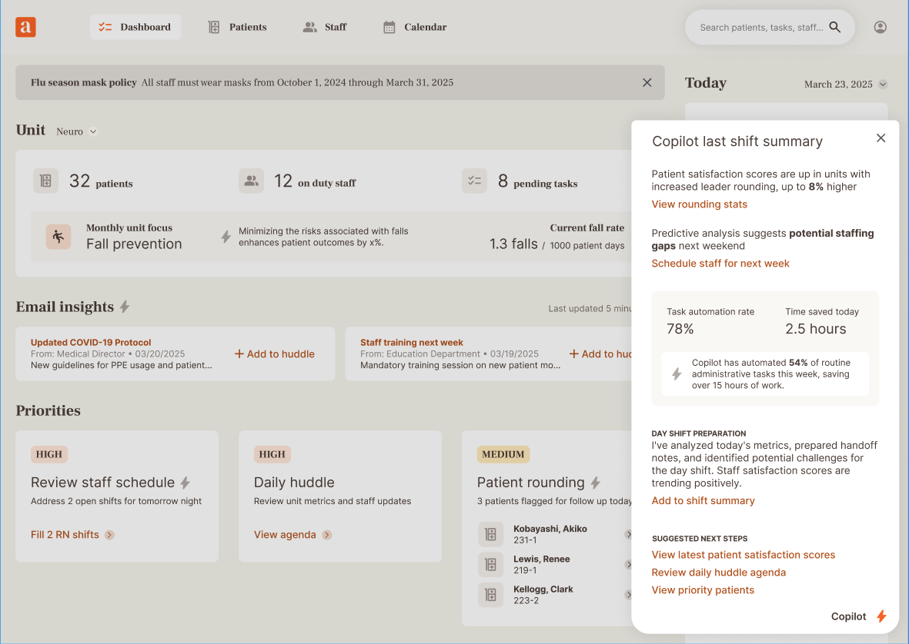

# Nursing Dashboard Takehome

## Tech Stack

- **Framework**: Next.js
- **Styling**: Tailwind CSS
- **UI Components**: shadcn/ui
- **Icons**: Lucide React

## Setup Instructions

1. Clone the repository
2. Install dependencies:
   ```bash
   npm install
   ```
3. Run the development server:
   ```bash
   npm run dev
   ```
4. Open [http://localhost:3000](http://localhost:3000) in your browser

## Contribution Guidelines

- Use a separate branch for your changes. Do not commit directly to `main`.
- Open a Pull Request (PR) to submit your work.

## Project Structure

```
├── app/
│   ├── page.tsx           # Main dashboard page
│   └── globals.css        # Global styles
├── components/
│   └── ui/               # Reusable UI components
├── lib/
│   └── data.ts           # Mock data and types
└── public/
    └── assets/           # Static assets
```

## Take-Home Assignment: Add a Modal Summary Component

### Objective

Add a component to the dashboard that displays a "Last Shift Summary" modal when the user clicks the "Full Night Shift Details" button, located at the bottom of the "Catch Up" section. The component should fetch mock data from an API endpoint and present it in a user-friendly format similar to the screenshot below.



### Requirements

1. **Design**: The component should match the existing design language of the dashboard (Tailwind CSS + shadcn/ui).

2. **API Integration**:

   - Create a mock API endpoint to provide data for the "Last Shift Summary" component.

3. **Component Behavior**:

   - Fetch data from the mock API endpoint and render it.
   - Highlight key metrics (e.g., automation rate, time saved).
   - Display suggested next steps as actionable links.

4. **Implementation Details**:
   - The modal doesn't have to look _exactly_ like the screenshot. Colors, styles and content should match, but the shape is not of concern.
   - All actionable links should have blank targets.

### Evaluation Criteria

1. Code quality and adherence to the project's conventions
2. Clear and responsive design implementation
3. Proper use of TypeScript and Tailwind CSS
4. Accurate data retrieval and presentation from the mock API
